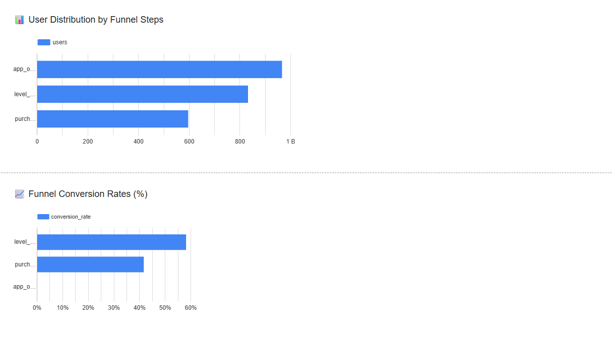
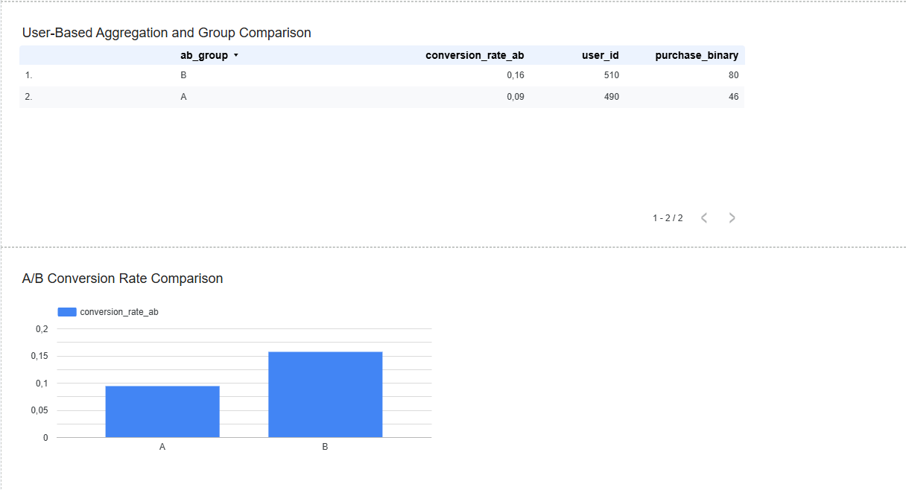
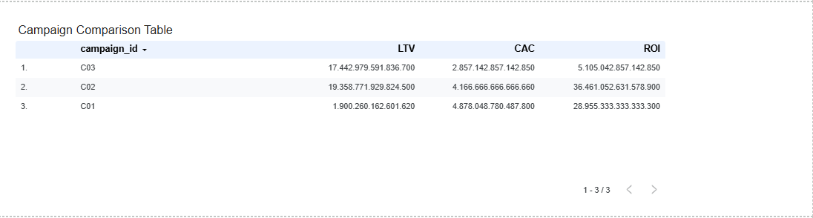

# 📱 Mobile App User Behavior Analysis Dashboard (Looker Studio)

## 🎯 Project Overview

This project simulates and analyzes user behavior within a mobile application using synthetic event data. The goal is to build an interactive analytics dashboard for product and growth teams — powered by **Looker Studio**, backed by **Python** and **SQL-style calculations**.

🔍 The analysis focuses on:
- Funnel metrics (e.g., app open → purchase)
- A/B test simulation and analysis
- Campaign performance (LTV, CAC, ROI)
- Looker Studio dashboards with actionable insights

---

## 📊 Dashboard Preview

| Funnel Analysis | A/B Test Results |
|-----------------|------------------|
|  |  |

| Campaign Analysis |
|------------------|
|  |

📌 [🖥️ Dashboard](https://lookerstudio.google.com/s/pYBVwPO4bMI)

---

## 🧱 Project Structure

mobile-user-behavior-dashboard/
│
├── data/
│ ├── events.csv # Simulated user events
│ ├── funnel_analysis.csv # Funnel step summaries
│ ├── campaign_analysis.csv # LTV, CAC, ROI per campaign
│ └── events_ab.csv # A/B test simulated data
│
├── notebooks/
│ ├── ab_test_analysis.ipynb # Chi-square test & analysis
│ └── ltv_cac_roi_calc.ipynb # Metric calculations
│
├── scripts/
│ └── generate_ab_test_data.py # A/B test data generator
│
├── assets/
│ └── screenshots/ # Dashboard image previews
│
└── README.md


---

## ⚙️ Technologies Used

| Tool/Tech         | Purpose                                |
|-------------------|----------------------------------------|
| `Python`          | Data simulation and metric calculations |
| `Pandas`          | Data wrangling                         |
| `Scipy`           | A/B test p-value calculation           |
| `Looker Studio`   | Dashboard creation & visualization     |
| `Google Sheets`   | Data source for Looker                 |
| `Jupyter Notebook`| Exploratory analysis and documentation |

---

## 🔍 Key Concepts

### 1. 📈 Funnel Analysis  
We analyzed user progression through the funnel:
- App Open → Level Complete → Purchase  
Metrics like `conversion_rate` were calculated to identify drop-off points.

### 2. 📊 LTV, CAC, ROI Analysis  
Simulated marketing campaigns allowed us to evaluate:
- **LTV (Lifetime Value)**
- **CAC (Customer Acquisition Cost)**
- **ROI (Return on Investment)**

### 3. 🧪 A/B Test Simulation  
We simulated a test where:
- **Group A** saw the original “Buy” button color  
- **Group B** saw a new color  
Statistical significance was tested using a **Chi-Square Test**.

---

## 🛠️ How to Run

### 1. Clone the repo
```bash
git clone https://github.com/your-username/mobile-user-behavior-dashboard.git
cd mobile-user-behavior-dashboard
```

### 2.Install dependencies

```bash
pip install pandas scipy jupyter
```

### 3. Run simulations and notebooks

```bash
python scripts/generate_ab_test_data.py
jupyter notebook notebooks/ltv_cac_roi_calc.ipynb
jupyter notebook notebooks/ab_test_analysis.ipynb

```

### 4. Upload CSVs to Google Sheets

Upload files from /data folder to Google Drive

Connect them to Looker Studio as data sources


## 📄 Google Sheets Tables

| Tablo Adı              | Açıklama                             | Görüntüle |
|------------------------|--------------------------------------|-----------|
| `funnel_analysis`      | App_open → Purchase funnel verisi     | [Görüntüle](https://docs.google.com/spreadsheets/d/1P_geN9UrvKfs9-9qKtKpiwnopMqHl6DC1I0r2LPcFBU/edit?usp=sharing) |
| `campaign_analysis`    | LTV / CAC / ROI hesapları             | [Görüntüle](https://docs.google.com/spreadsheets/d/1zQTLUPFcH7AHj4Ai0O9SzevUdo2nis3dXjEQNoLrSPI/edit?usp=sharing) |
| `events_ab`            | A/B test event datası                 | [Görüntüle](https://docs.google.com/spreadsheets/d/1tu_U_oHBT-pOxSMONQlw51JMXEkoGSg6nQtR4HiyKMY/edit?usp=sharing) |


